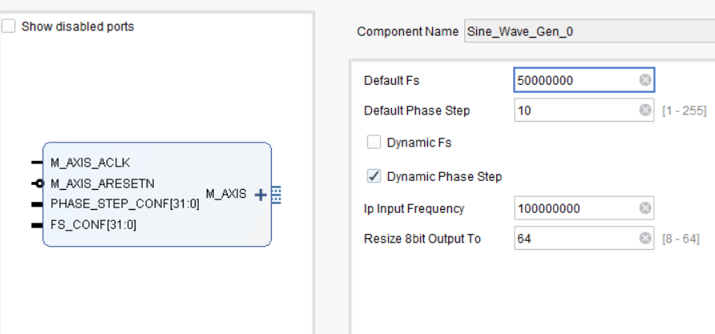

# Sine_Wave_Gen



## Overview

`Sine_Wave_Gen` is a synthesizable VHDL module that generates an 8-bit sine wave using a precomputed lookup table. The output frequency is configurable at runtime using a dynamic phase increment. The design is compatible with AXI Stream (AXIS) interfaces and suitable for integration with FFT, DAC, or streaming pipelines.

> **Inspired by**: [SINE_WAVE_VHDL_GENERATOR](https://github.com/iamhosseinali/SINE_WAVE_VHDL_GENERATOR)

---

## Features

- Outputs 8-bit signed sine wave samples
- Uses a 256-entry LUT for sine samples (i.e., phase resolution = 8 bits)
- Supports dynamic output frequency adjustment via:
  - **Phase increment control** (optional)
- Fully AXI-Stream compatible (`tDATA`, `tVALID`)
- Configurable via 32-bit control words

---

## Frequency Formula

When using a fixed sampling rate (`Fs`):

```

f_out = (phase_step × Fs) / 2^8

```

To generate a target output frequency:

```

phase_step = (f_out × 256) / Fs

```

---

## Ports

| Signal            | Direction | Width | Description |
|-------------------|-----------|-------|-------------|
| `M_AXIS_ACLK`     | `in`      | 1     | Clock input |
| `M_AXIS_ARESETN`  | `in`      | 1     | Active-low reset |
| `M_AXIS_tDATA`    | `out`     | 8     | Sine wave output (signed) |
| `M_AXIS_tVALID`   | `out`     | 1     | Indicates valid output |
| `PHASE_STEP_CONF` | `in`      | 32    | Dynamic phase increment config: <br> Bit 31 = valid, Bits [7:0] = phase step |
| `FS_CONF`         | `in`      | 32    | Dynamic sample rate config: <br> Bit 31 = valid, Bits [30:0] = (Input Freq / Fs) - 1 |

---

## Generics

| Name                 | Default       | Description |
|----------------------|---------------|-------------|
| `Dynamic_Fs`         | `false`       | Enables runtime sampling rate control |
| `Dynamic_Phase_Step` | `false`       | Enables runtime phase step control |
| `IP_INPUT_FREQUENCY` | `100_000_000` | Clock frequency of `M_AXIS_ACLK` in Hz |
| `DEFAULT_Fs`         | `100_000_000` | Default output sampling rate (Hz) |
| `DEFAULT_PHASE_STEP` | `1`           | Default DDS phase increment (1–255) |

---

## Behavior

1. When `Dynamic_Fs = true`, the output rate is gated by `FS_CONF`.
   - Output updates occur once every `(IP_INPUT_FREQUENCY / Fs) - 1` clock cycles.
2. When `Dynamic_Phase_Step = true`, the frequency can be changed at runtime by updating `PHASE_STEP_CONF(7:0)`.
3. LUT index is advanced by `phase_step`, producing the output sine waveform.
4. AXIS signals (`tDATA`, `tVALID`) are asserted only when valid output is generated.

---

## Output Waveform Resolution

- **Amplitude resolution**: 8 bits (signed)
- **Phase resolution**: 8 bits (256 samples per cycle)
- **Output frequency resolution**:  
  Depends on `phase_step` and `Fs`. Smallest `f_out` step:

```

delta_f = Fs / 256

```

---

## Clone and Recreation

This project was built with Vivado 2018.2. Make sure you use the exact version for full compatibility.

Recommended directory structure for IPs:

```

ip_repo/
├── HDL/
│   ├── HDL_IP_1/
│   └── HDL_IP_2/
└── HLS/
├── HLS_IP_1/
└── HLS_IP_2/

````

> Recreate HLS IPs before sourcing the Vivado project TCL script.

### Recreating the PL Project

In Vivado TCL Console (or command prompt with Vivado environment sourced), run:


``` source c:/.../project_name/project_name.tcl ```

Wait until the recreation process completes.

Refer to this [repo](https://github.com/iamhosseinali/vivado-git) and look for the correct branch based on your Vivado version to learn how to properly manage Git with Vivado-generated files.